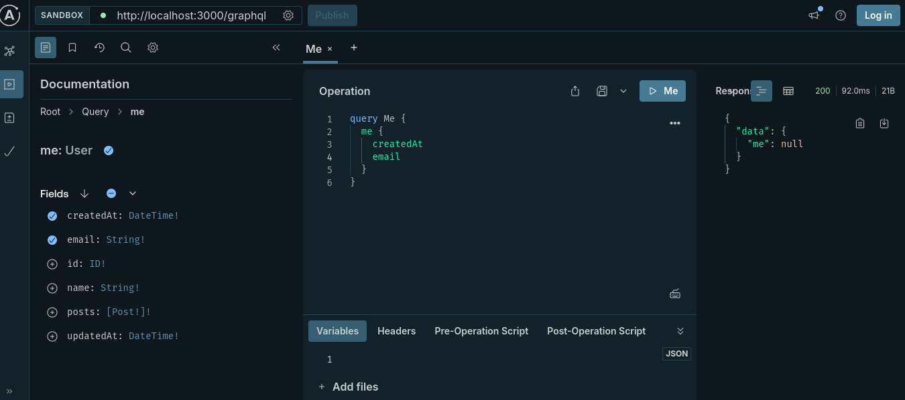

# Play with GraphQL

This is a simple implementation of GraphQL with Node.js and Express. In this project, I've implemented simple CRUD operations with Authentication and Authorization.

## What is GraphQL?

GraphQL is a query language for APIs and a runtime for fulfilling those queries with your existing data. GraphQL provides a complete and understandable description of the data in your API, gives clients the power to ask for exactly what they need and nothing more, makes it easier to evolve APIs over time, and enables powerful developer tools.

**Pros:**

-   Client can request exactly what they need
-   Easy to evolve API
-   Powerful developer tools

**Cons:**

-   Not suited for all use cases
-   Not a silver bullet for all API problems
-   Can be more expensive than REST
-   Not as widely supported as REST

## Setup

Clone the repository

```bash
git clone https://github.com/sfsajid91/play-with-graphql.git
```

Install dependencies

```bash
pnpm install
```

Copy the `.env.example` file to `.env` and set the environment variables

```bash
cp .env.example .env
```

Set up the environment variables:

| Variable         | Description                                                                                                      |
| ---------------- | ---------------------------------------------------------------------------------------------------------------- |
| **PORT**         | The port number on which the server will run                                                                     |
| **DATABASE_URL** | The path to the database file. Default: `file:../db/dev.db`                                                      |
| **JWT_SECRET**   | A secret key used for signing and verifying JWT tokens. Generate a random string using `openssl rand -base64 32` |

## Sync Database

```bash
pnpm prisma migrate deploy
```

## Start the development server

```bash
pnpm dev
```

## Play with GraphQL

Open your browser and navigate to `http://localhost:3000/graphql` to access the GraphQL playground.



## API Documentation

You can use the following queries and mutations to interact with the API.

### Queries

`me` - Get the current user

`posts` - Get all posts

Both queries are protected and require a valid JWT token in the header. You can get the token by logging in.

### Mutations

`login(email: String!, password: String!): AuthPayload!` - Login with email and password and get the user and token

`signup(name: String!, email: String!, password: String!): AuthPayload!` - Signup with name, email and password and get the user and token

`createPost(title: String!, content: String!): Post` - Create a new post

### Authorization

Authorization is done using JWT. The token is returned after login or signup. You need to set the token in the header to access the protected routes.

`Authorization: Bearer <token>`

## Deployment

Build the project

```bash
pnpm build
```

Start the project

```bash
pnpm start
```

## Built With

-   [Node.js](https://nodejs.org/en/)
-   [Express](https://expressjs.com/)
-   [Prisma](https://prisma.io/)
-   [Apollo Server](https://www.apollographql.com/docs/apollo-server/)
-   [GraphQL](https://graphql.org/)
-   [SQLite](https://www.sqlite.org/index.html)
-   [SWC](https://swc.rs/)
-   [TypeScript](https://www.typescriptlang.org/)
-   [JWT](https://jwt.io/)
-   [Zod](https://zod.dev/)
